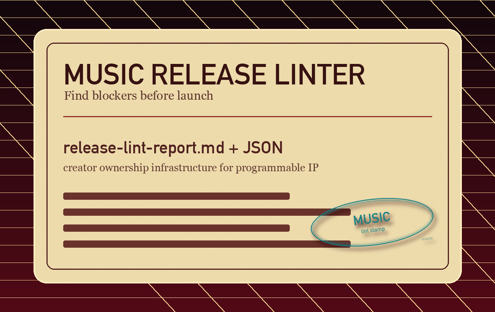

# Suede Creator Skills


**Suede Creator Skills** is a public skill pack for AI coding agents and
creator workflows. It turns a music release folder into two concrete outputs:
a release-readiness lint report and a Suede Rights Passport transfer package.
Use it to make music, audio, video, and media projects release-ready,
rights-aware, provenance-ready, and easier to prepare for Suede optimization.

The public page presents the workflow as a Suede Creator Passport: website
visits, app opens, Discord joins, X follows, Telegram visits, GitHub installs,
Codex and Claude installs, release linting, transfer packaging, Suede Holder
context, and Suede signing workflows become stampable participation signals.

Suede is creator ownership infrastructure for programmable IP, registry-backed
media, royalty routing, licensing readiness, and agent commerce. These skills
are offline-first and public-safe: they inspect and organize local project
folders, but they do not upload files, write to a registry, call private Suede
services, request secrets, or claim legal clearance.

For the full concept — what the Passport is, what it gates, which signals
become stamps, and what intentionally ships later — see
[`PASSPORT.md`](PASSPORT.md).

## Public Page

- [GitHub Pages site](https://jasoncolapietro.github.io/suede-creator-skills/)
- [GitHub repository](https://github.com/JasonColapietro/suede-creator-skills)
- [Suede Creator Passport concept](PASSPORT.md)
- [Suede Creator Skills copy bank](COPY.md) - public copy for GitHub descriptions, docs pages, CTAs, SEO snippets, FAQs, social posts, and safety language.
- [Copy bank page](https://jasoncolapietro.github.io/suede-creator-skills/copy.html) - live copy bank for sharing, pitching, and documentation work.
- [Skill docs catalog](https://jasoncolapietro.github.io/suede-creator-skills/skills/) - public catalog with every skill page, install link, manifest link, script link, and resource map.
- [Suede Rights Passport docs](https://jasoncolapietro.github.io/suede-creator-skills/skills/suede-rights-passport.html) - full documentation for transfer package generation, provenance, credits, splits, licenses, Suede intake JSON, templates, safety defaults, and install prompts.
- [Music Release Metadata Linter docs](https://jasoncolapietro.github.io/suede-creator-skills/skills/music-release-metadata-linter.html) - full documentation for music release linting, metadata checks, missing-file detection, rights blockers, report outputs, templates, and Suede next steps.

## Quick Start

```bash
git clone https://github.com/jasoncolapietro/suede-creator-skills.git
cd suede-creator-skills

python3 skills/music-release-metadata-linter/scripts/lint_release.py \
  /path/to/music-project \
  --output /path/to/release-lint-output

python3 skills/suede-rights-passport/scripts/create_transfer_package.py \
  /path/to/creator-project \
  --output /path/to/suede-transfer-package \
  --metadata /path/to/creator-project/metadata.json \
  --project-title "Project Title" \
  --artist "Artist Name"
```

Both scripts skip hidden files, secret-like files, dependency folders, build
outputs, and unrecognized file types by default.

Safety-oriented CLI flags:

- `--include-hidden`: include hidden files and folders, while still skipping
  secret-like files.
- `--include-other`: include unrecognized file types in inventories.
- `--include-absolute-paths`: write absolute local paths into reports for
  private operator workflows. Reports use share-safer paths by default.
- `--force`: replace existing generated report/package files.

## Skills Included

### Suede Rights Passport


Folder: [`skills/suede-rights-passport`](skills/suede-rights-passport)

Turn a messy creator folder into a Suede-ready transfer package. The skill
inventories media, documents, lyrics, artwork, stems, credits, splits, licenses,
provenance notes, missing rights information, and optimization blockers.

Outputs include:

- `RIGHTS_PASSPORT.md`
- `suede-intake.json`
- `provenance.md`
- `credits-and-splits.md`
- `license-notes.md`
- `optimization-brief.md`
- `missing-info-report.md`

Run it locally:

```bash
python3 skills/suede-rights-passport/scripts/create_transfer_package.py \
  /path/to/creator-project \
  --output /path/to/suede-transfer-package \
  --project-title "Project Title" \
  --artist "Artist Name" \
  --copy-assets
```

The script refuses to write the package into or under the source folder and
requires `--force` before replacing existing generated package files.

To prefill the package with known rights facts, pass `--metadata` with a
public-safe JSON, YAML, or key=value text metadata file. Do not point metadata
at real `.env`, credential, wallet, or deployment config files. Metadata can
provide project title, artist, owner claim, ownership status, contributor
confirmations, splits status, sample status, clearance notes, wallet/payment
destination, release history, public URLs, and provenance notes. Unknown or
unconfirmed facts remain flagged in the generated reports.

### Music Release Metadata Linter



Folder: [`skills/music-release-metadata-linter`](skills/music-release-metadata-linter)

Audit a song, album, catalog, stem pack, or media project before release,
licensing, registry preparation, agent commerce, or Suede intake. The linter
checks for missing title, artist, metadata, final masters, artwork, lyrics,
stems, contributors, split totals, sample status, release history, provenance
notes, and Suede-readiness blockers.

Outputs include:

- `release-lint-report.md`
- `release-lint-report.json`

Run it locally:

```bash
python3 skills/music-release-metadata-linter/scripts/lint_release.py \
  /path/to/music-project \
  --output /path/to/release-lint-output
```

With metadata:

```bash
python3 skills/music-release-metadata-linter/scripts/lint_release.py \
  /path/to/music-project \
  --metadata /path/to/music-project/metadata.json \
  --output /path/to/release-lint-output
```

## Install For Codex

Codex skills live in `$CODEX_HOME/skills`, falling back to `~/.codex/skills`
when `CODEX_HOME` is not set.

```bash
git clone https://github.com/jasoncolapietro/suede-creator-skills.git
cd suede-creator-skills

mkdir -p "${CODEX_HOME:-$HOME/.codex}/skills"
cp -R skills/suede-rights-passport "${CODEX_HOME:-$HOME/.codex}/skills/"
cp -R skills/music-release-metadata-linter "${CODEX_HOME:-$HOME/.codex}/skills/"
```

Example Codex prompts:

```text
Use $music-release-metadata-linter to audit this album folder for release readiness.
```

```text
Use $suede-rights-passport to prepare this creator project as a Suede transfer package.
```

## Install For Claude Code

Claude Code skills use `SKILL.md` files in `.claude/skills/` directories. For a
project-level install:

```bash
git clone https://github.com/jasoncolapietro/suede-creator-skills.git /tmp/suede-creator-skills
cd /path/to/your-project

mkdir -p .claude/skills
cp -R /tmp/suede-creator-skills/skills/suede-rights-passport .claude/skills/
cp -R /tmp/suede-creator-skills/skills/music-release-metadata-linter .claude/skills/
```

For a user-level install:

```bash
mkdir -p ~/.claude/skills
cp -R skills/suede-rights-passport ~/.claude/skills/
cp -R skills/music-release-metadata-linter ~/.claude/skills/
```

Example Claude Code prompts:

```text
Use the music-release-metadata-linter skill to check this release folder.
```

```text
Use the suede-rights-passport skill to organize this catalog for Suede intake.
```

Claude.ai and organization-managed Claude Skills may use upload or admin-managed
skill flows instead of direct filesystem copy. Review the skill contents before
enabling code execution.

## How The Workflow Fits Together

```text
creator folder
  -> release metadata lint
  -> missing info and rights fixes
  -> Suede Rights Passport package
  -> Suede review, registry readiness, royalty routing, licensing, optimization
```

Use the linter first when you want a fast audit. Use the Rights Passport when
you are ready to create a durable transfer package for Suede review and
optimization.

## Full Linkset

These public links are also passport stamp locations. The page frames each
creator action as a stampable signal: visit, join, follow, install, lint, and
passport.

Suede public links:

- Website: <https://suedeai.ai>
- App / Vaults: <https://app.suedeai.ai>
- Long-form site: <https://suedeai.org>
- Follow on X: <https://x.com/aisuede>
- Join Discord: <https://discord.gg/suedeai>
- Telegram: <https://t.me/suedeai>

Project links:

- GitHub repository: <https://github.com/JasonColapietro/suede-creator-skills>
- GitHub Pages site: <https://jasoncolapietro.github.io/suede-creator-skills/>
- Skill docs catalog: <https://jasoncolapietro.github.io/suede-creator-skills/skills/> - public index for every Suede Creator Skill and its install/resource links.
- Copy bank page: <https://jasoncolapietro.github.io/suede-creator-skills/copy.html> - live GitHub, docs, CTA, SEO, FAQ, social, and safety copy for Suede Creator Skills.
- Copy bank source: [COPY.md](COPY.md) - reusable public copy for repo metadata, skill pages, install surfaces, launch posts, and claim boundaries.
- Suede Rights Passport docs: <https://jasoncolapietro.github.io/suede-creator-skills/skills/suede-rights-passport.html> - transfer package docs for creator rights, provenance, splits, license notes, intake JSON, and optimization briefs.
- Music Release Metadata Linter docs: <https://jasoncolapietro.github.io/suede-creator-skills/skills/music-release-metadata-linter.html> - release-readiness docs for metadata, artwork, masters, lyrics, stems, credits, samples, reports, and Suede blockers.
- Rights Passport skill: [skills/suede-rights-passport/SKILL.md](skills/suede-rights-passport/SKILL.md)
- Rights Passport script: [skills/suede-rights-passport/scripts/create_transfer_package.py](skills/suede-rights-passport/scripts/create_transfer_package.py)
- Rights Passport OpenAI metadata: [skills/suede-rights-passport/agents/openai.yaml](skills/suede-rights-passport/agents/openai.yaml)
- Rights Passport references: [skills/suede-rights-passport/references/](skills/suede-rights-passport/references/)
- Rights Passport templates: [skills/suede-rights-passport/assets/](skills/suede-rights-passport/assets/)
- Release Linter skill: [skills/music-release-metadata-linter/SKILL.md](skills/music-release-metadata-linter/SKILL.md)
- Release Linter script: [skills/music-release-metadata-linter/scripts/lint_release.py](skills/music-release-metadata-linter/scripts/lint_release.py)
- Release Linter OpenAI metadata: [skills/music-release-metadata-linter/agents/openai.yaml](skills/music-release-metadata-linter/agents/openai.yaml)
- Release Linter references: [skills/music-release-metadata-linter/references/](skills/music-release-metadata-linter/references/)
- Release Linter templates: [skills/music-release-metadata-linter/assets/](skills/music-release-metadata-linter/assets/)
- Passport concept: [PASSPORT.md](PASSPORT.md)
- Page source: [docs/index.html](docs/index.html)
- Skill docs source: [docs/skills/](docs/skills/)

Platform references:

- OpenAI Skills examples: <https://github.com/openai/skills>
- Claude Code skills documentation: <https://docs.claude.com/en/docs/claude-code/skills>
- Claude Skills help center: <https://support.claude.com/en/articles/12512180-using-skills-in-claude>

Suede language to preserve:

- creator ownership infrastructure
- programmable IP
- provenance
- registry-backed media
- royalty routing
- licensing readiness
- rights-aware media workflows
- agent commerce

Passport stamp language:

- website visit
- app visit
- Discord join
- X follow
- Telegram visit
- GitHub install, star, or fork
- Codex install
- Claude install
- Suede Holder participation stamp
- Suede signing workflow
- release lint
- rights passport package
- future engagement signal
- careful participation trail

## About the Creator

**Jason Colapietro** is the founder and CEO of [Suede Labs AI](https://suedeai.ai), a published author, and a Forbes contributor. He builds programmable IP and creator ownership infrastructure for AI-native media.

> "The gap in the creator economy isn't talent. It's the gap between the moment you make something and the moment you own it in a form that can be licensed, monetized, and defended."

> "Rights metadata is the dark matter of the creative economy. It governs everything. Almost nobody can see it."

> "Every piece of music that enters the world has a signal chain. The IP chain is just the part most musicians never mapped until now."

> "Build what doesn't exist yet. Register that you built it. That sequence is the whole game."

### Books by Jason Colapietro

- **[The Signal Chain](https://guitar.solutions)**: Illustrated electric-guitar tone history, memoir, method, and workbook editions. From pickup to speaker, from gear to IP. (guitar.solutions)
- **[The Guitar Without a Number](https://www.amazon.com/stores/author/B0GD5FX6N6)**: Memoir-driven guitar instruction for the self-taught player. Theory, tone, artist songbooks, and a music IP rights chapter. (Amazon author store)
- **[Suede Labs: The Human Authenticity Layer](https://www.amazon.com/dp/B0GD5FX6N6)**: How ownership, origin, and AI redraw the creative map. (Kindle)
- **[Proof as Infrastructure](https://www.amazon.com/dp/B0GMB2VLXQ)**: Designing durable systems without trust assumptions. (Kindle)
- **[Stake Your Claim](https://www.amazon.com/dp/B0GRG8LGQQ)**: Hard truths on turning the AI era into a real asset. (Kindle)

Follow: [X / @johnnysuede](https://x.com/johnnysuede) · [suedeai.ai](https://suedeai.ai) · [suedeai.ai/founder](https://suedeai.ai/founder)


## Public Safety

A clean lint report or completed transfer package is not a legal opinion,
distributor approval, registry write, or rights clearance. These skills prepare
materials so creators, Suede, and advisors can review the work with better
structure.

Generated reports and transfer packages are private drafts by default. They can
contain creator names, wallet/payment notes, file names, hashes, rights claims,
contributor details, restrictions, and provenance notes. Review and redact them
before publishing, committing, or sending outside the intended workflow.

## Status

The scripts are dependency-light Python and run with the standard library.
Optional enhancements use installed packages when available, such as Pillow for
artwork dimension checks or PyYAML for YAML metadata parsing.

YAML metadata support requires PyYAML:

```bash
python3 -m pip install PyYAML
```

## License And Contributions

Released under the [MIT License](LICENSE).

Contributions are welcome for docs fixes, install-path corrections, lint rules,
template improvements, and public-safe workflow improvements. Do not submit
private catalogs, unreleased media, credentials, seed phrases, private Suede API
details, payment secrets, or third-party copyrighted files.
