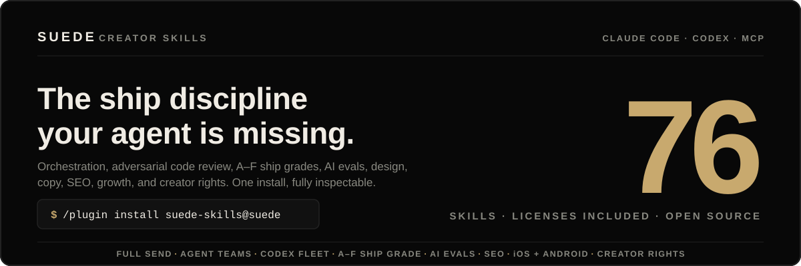
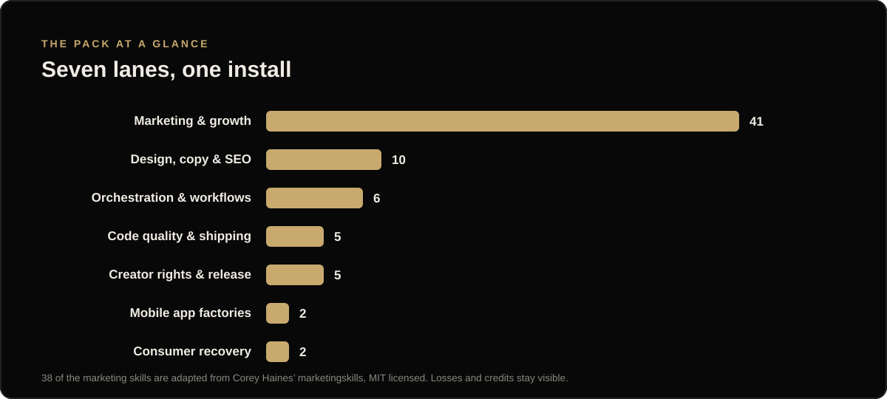
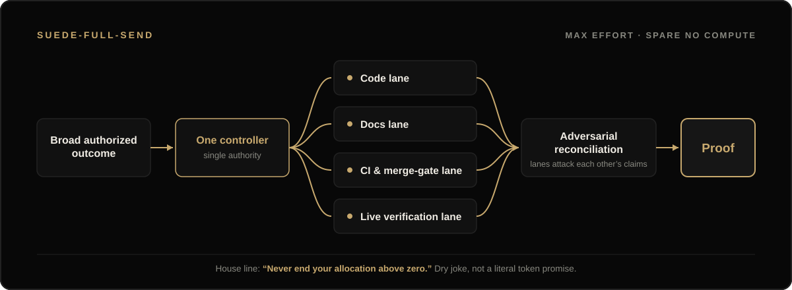
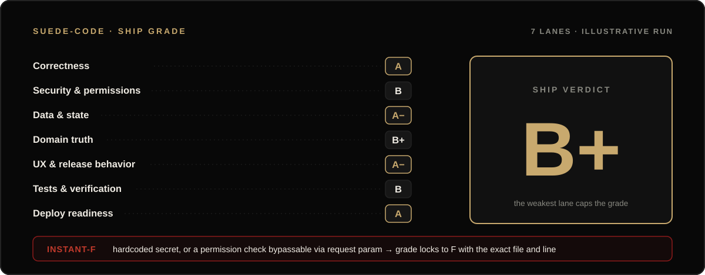

<div align="center">



<br><br>

[](#the-skills)
[](LICENSE)
[](#install-in-30-seconds)
[](#install-in-30-seconds)
[](#mcp-server)
[](https://github.com/JasonColapietro/suede-creator-skills/stargazers)

**[Install](#install-in-30-seconds)** · **[The skills](#the-skills)** · **[Docs site](https://skills.suedeai.ai/)** · **[Skill catalog](https://skills.suedeai.ai/skills/)** · **[Blog](https://skills.suedeai.ai/blog/)** · **[MCP](#mcp-server)** · **[@johnnysuede](https://x.com/johnnysuede)**

<sub>By <a href="https://suedeai.ai/founder">Jason Colapietro</a> / <a href="https://suedeai.ai">Suede Labs AI</a></sub>

</div>

---

Your coding agent is fast, capable, and completely unsupervised. It will happily ship the bug, skip the test, publish the slop, and tell you everything went great.

This pack is the supervision: **71 public skill folders**, MIT-licensed and broadly reusable, for Claude Code, OpenAI Codex, and any skills-compatible agent. Outcome-bound orchestration, multi-agent teams, Codex worker fleets, code review with a blunt A–F ship grade, AI evals, design, conversion copy, SEO, 39 marketing lanes, mobile app factories, and creator-rights tooling. Every skill is a plain `skills/<name>/SKILL.md` file you can read before you trust it. No binaries, no telemetry, no accounts.



## Install in 30 seconds

**Claude Code** — add the marketplace, install the pack:

```text
/plugin marketplace add JasonColapietro/suede-creator-skills
/plugin install suede-skills@suede
```

`suede-skills` installs all 71 skills. Want less? Two focused subsets: `/plugin install suede-agent-workflows@suede` (Full Send, orchestration, workflows, evals) and `/plugin install suede-code@suede` (review, grade, ship-gate).

**Codex** — add the Codex-native marketplace, install the complete plugin:

```bash
codex plugin marketplace add JasonColapietro/suede-creator-skills --ref main
codex plugin add suede-skills@suede-codex
```

The Codex plugin loads all 71 skills and registers both read-only MCP discovery profiles. Restart Codex after installing or updating.

**Any agent** (Cursor, Copilot, Windsurf, Claude Code, Codex) via the [skills CLI](https://github.com/vercel-labs/skills):

```bash
npx skills add JasonColapietro/suede-creator-skills
```

**Prefer a clone?** `install.sh` copies all 71 skills into `~/.claude/skills/` and prints the installed count:

```bash
git clone https://github.com/JasonColapietro/suede-creator-skills.git && bash suede-creator-skills/install.sh
```

You can also copy individual skill folders into `.claude/skills/` (project) or `~/.claude/skills/` (user).

<details>
<summary><b>More install routes</b> (single-skill Codex installer, project-level copy, MCP)</summary>

<br>

**Codex — install one skill from GitHub:**

```bash
python3 ~/.codex/skills/.system/skill-installer/scripts/install-skill-from-github.py \
  --repo JasonColapietro/suede-creator-skills \
  --path skills/suede-agent-teams
```

Swap `skills/<skill>` for any skill folder, or pass extra `skills/<name>` paths to install several at once. Restart Codex after installing.

**Claude Code — project-level copy of a single skill:**

```bash
git clone https://github.com/JasonColapietro/suede-creator-skills.git /tmp/suede-creator-skills
mkdir -p .claude/skills
cp -R /tmp/suede-creator-skills/skills/suede-agent-teams .claude/skills/
```

For a user-level install, copy into `~/.claude/skills/` instead. Claude.ai and organization-managed Claude Skills may use upload or admin-managed flows instead of filesystem copy. Review skill contents before enabling code execution.

**MCP — dependency-free stdio server:**

```bash
node mcp/suede-skills-mcp.mjs --profile all
```

Exposes 7 tools (`list_suede_skills`, `get_suede_skill`, `suede_install_options`, `suede_copy_seo_audit`, `suede_visibility_grade`, `suede_code_grade`, `suede_qa_checklist`), 6 resources, and 5 prompts over JSON-RPC.

</details>

## Try it right now

Install the pack, then ask for a code review with a ship grade on your current changes:

```text
Use suede-code to review my staged diff and give it an A-F ship grade.
```

For a broad authorized outcome, invoke Full Send directly:

```text
Use suede-full-send to finish this release across code, docs, CI, and live verification. Preserve unrelated WIP and return proof.
```

If the pack saves you an hour, [star the repo](https://github.com/JasonColapietro/suede-creator-skills/stargazers) — stars are how other builders find it.

## Full Send: broad outcomes, one authority

Tell your agent "max effort, spare no compute, fix everything" and most of the time you get enthusiasm, not engineering. [`suede-full-send`](skills/suede-full-send) turns that intent into a structure: one authorized controller, every useful non-colliding lane running in parallel, adversarial reconciliation where lanes attack each other's claims, and a close that is either concise proof or one named blocker.



The rest of the orchestration lane backs it up:

- [`suede-agent-teams`](skills/suede-agent-teams) wires complex changes into coordinated agent lanes with WIP collision detection, RFC mode, feature-flag strategy, rollback trees, and a handoff checklist that won't close without evidence. Its public-contribution mode adds scored issue queues, atomic leases, isolated worktrees, and authority-gated contribution packets.
- [`suede-ship`](skills/suede-ship) runs the canonical orchestration DAG on a repo: scout, multi-lens research, a red-teamed lane plan, disjoint build lanes, dual-lens review, adversarial refutation, an integration gate, and a release verifier with an evidence handoff.
- [`suede-ship-copy`](skills/suede-ship-copy) is the same DAG rebuilt for one high-stakes piece of writing: five blind research lenses, a claim audit that closes the set of assertable facts, disjoint section writers, adversarial refutation, a deslop pass, and a publish-readiness gate.
- [`suede-codex-fleet`](skills/suede-codex-fleet) is the Suede Fable Fleet: a Claude orchestrator decomposes a high-volume job, writes self-contained briefs, spawns parallel OpenAI Codex CLI `codex exec` workers, and reviews every output against acceptance criteria before anything ships. Claude judges, Codex generates.

## The A–F ship grade

[`suede-code`](skills/suede-code) runs a findings pass (TypeScript, React, Next.js, OWASP, and database checklists), then returns a grade card scoring seven lanes: Correctness, Security and permissions, Data and state, Domain truth, UX and release behavior, Tests and verification, and Deploy readiness. The weakest lane caps the grade, and auth and payment surfaces carry grade caps of their own.



If it hits an instant-F trigger — a hardcoded secret, a permission check bypassable via a request param — the grade locks to F with the exact file and line, and no other lane can raise it. A polite review tells you what could be better. A grade tells you whether to ship.

## The skills

Every link below goes to the skill's folder in this repo; the [skill catalog](https://skills.suedeai.ai/skills/) has the same list with install commands per skill.

### Agent orchestration & workflows

| Skill | What it does |
|---|---|
| [`suede-full-send`](skills/suede-full-send) | Full Send broad authorized outcomes through one controller, useful non-colliding lanes, adversarial reconciliation, and proof |
| [`suede-agent-teams`](skills/suede-agent-teams) | Coordinate agent lanes and public contribution programs with collision checks, atomic issue leases, review gates, and a signed handoff |
| [`suede-ship`](skills/suede-ship) | The canonical orchestration DAG for repo changes: research, red-teamed planning, disjoint lanes, adversarial review, release verification |
| [`suede-ship-copy`](skills/suede-ship-copy) | Copy-only orchestration DAG for one high-stakes piece: blind research, claim audit, section writers, refutation, publish gate |
| [`suede-codex-fleet`](skills/suede-codex-fleet) | Suede Fable Fleet: brief, spawn, and review parallel OpenAI Codex CLI workers — Claude judges, Codex generates |
| [`suede-ai-eval`](skills/suede-ai-eval) | AI-SPEC artifacts, failure-mode rubrics, eval cases, and acceptance gates for LLM, RAG, classifier, and agent surfaces |
| [`suede-recommend-next-action`](skills/suede-recommend-next-action) | Scores candidate moves on goal fit, unblocking, evidence, urgency, and leverage, then hands back one recommendation as a short runnable prompt |
| [`suede-workflow-skills`](skills/suede-workflow-skills) | Umbrella skill that loads the full pack |

### Code quality & shipping

| Skill | What it does |
|---|---|
| [`suede-code`](skills/suede-code) | Review + A–F grade in one pass |
| [`suede-code-review`](skills/suede-code-review) | Deep findings with Accessibility and SEO lanes, no letter grade |
| [`suede-code-grader`](skills/suede-code-grader) | A–F ship verdict only, 7 lanes, instant-F triggers |
| [`suede-ci-gate`](skills/suede-ci-gate) | Write CI that gates the merge — stack/lockfile detection, one required check, branch protection |
| [`suede-clip-to-guide`](skills/suede-clip-to-guide) | Turn a clip, talk moment, or transcript into a clip-to-guide funnel package with rights routing and an evidence gate |

### Design, copy & SEO

| Skill | What it does |
|---|---|
| [`johnny-suede-design`](skills/johnny-suede-design) | Full design lane: brand and product surfaces, tokens, visual QA |
| [`johnny-suede-write`](skills/johnny-suede-write) | Full writing lane: structure, persuasion frameworks, anti-slop gate, copy score |
| [`suede-design`](skills/suede-design) | Design laws, dark-mode tokens, fluid type, component rules |
| [`suede-copy`](skills/suede-copy) | Conversion copy: headline formulas, A/B variants, anti-slop gate |
| [`suede-deslop`](skills/suede-deslop) | Strips AI writing patterns from prose before it ships: merged kill list, structure fixes, active voice, varied rhythm, and a 50-point score gate |
| [`suede-seo-audit`](skills/suede-seo-audit) | SEO/AEO/AI-EO, metadata, schema, internal-link, and intent audit |
| [`suede-visibility-grader`](skills/suede-visibility-grader) | A–F page grades for findability, clarity, CTA pull, proof, and AI citation readiness |
| [`suede-site-alchemy`](skills/suede-site-alchemy) | Funnel analysis, friction audit, conversion math, ranked quick-wins |
| [`suede-launch-packaging`](skills/suede-launch-packaging) | Package work as a launch: docs, install commands, proof links, QA |
| [`suede-mcp-qa`](skills/suede-mcp-qa) | QA the Suede Skills MCP before it ships |

### Mobile app factories

| Skill | What it does |
|---|---|
| [`site-to-ios-app`](skills/site-to-ios-app) | Convert any website into an App Store-ready iOS app: audit, 4.2 wrapper-risk gate, shell strategy, release gate |
| [`android-app-factory`](skills/android-app-factory) | One prompt to a Play Store-ready native Android app: Kotlin + Jetpack Compose scaffold, Play Billing, ASO listing, signed release |

### Consumer recovery — the negotiation lane, proven outside a repo

| Skill | What it does |
|---|---|
| [`amazon-returns-recovery`](skills/amazon-returns-recovery) | The pack's contract negotiator, run against a real account instead of a repo: scan Amazon order/return history and digital subscriptions (Britbox, Starz, Audible, Kindle Unlimited, and more) for restocking fees, short refunds, and forgotten charges, then drive Amazon live chat to waive, refund, or cancel them — includes a validated click-path and popup workaround for the fee-dispute flow. Real recoveries: $448.31, including a previously denied refund overturned after the return window closed |
| [`subscription-recovery`](skills/subscription-recovery) | Audit recurring charges outside Amazon across App Store, Google Play, PayPal, bank/card evidence, and direct-bill services; report findings first and require confirmation before cancellation or refund contact |

### Creator rights & release

Rights and release-prep tooling for working musicians and creators — see the [skill catalog](https://skills.suedeai.ai/skills/) for each one: [`suede-campaign-in-a-box`](skills/suede-campaign-in-a-box), [`suede-sync-packaging`](skills/suede-sync-packaging), [`suede-release-linter`](skills/suede-release-linter), [`suede-rights-passport`](skills/suede-rights-passport), [`suede-rights-audit`](skills/suede-rights-audit).

### Marketing & growth

Thirty-nine skills covering paid acquisition and outbound, monetisation, lifecycle and
retention, and the measurement and operations layer — `suede-ads`, `suede-ad-creative`,
`suede-cold-email`, `suede-prospecting`, `suede-public-relations`, `suede-directory-submissions`,
`suede-pricing`, `suede-offers`, `suede-paywalls`, `suede-signup`, `suede-onboarding`,
`suede-churn-prevention`, `suede-emails`, `suede-referrals`, `suede-co-marketing`,
`suede-community-marketing`, `suede-lead-magnets`, `suede-free-tools`, `suede-sms`,
`suede-marketing-loops`, `suede-analytics`, `suede-ab-testing`, `suede-revops`,
`suede-sales-enablement`, `suede-programmatic-seo`, `suede-content-strategy`,
`suede-marketing-plan`, `suede-marketing-psychology`, `suede-marketing-council`, `suede-instagram-growth`, `suede-social`,
`suede-aso`, `suede-video`, `suede-image`, `suede-product-marketing`, `suede-competitors`,
`suede-competitor-profiling`, `suede-customer-research`, `suede-marketing-ideas`.

Adapted from [marketingskills](https://github.com/coreyhaines31/marketingskills) by Corey Haines
under the MIT License — see [NOTICE.md](NOTICE.md).

## From the blog

Essays on why the pack is built the way it is:

- [**71 skills installed. Your agent reads almost none of them.**](https://skills.suedeai.ai/blog/progressive-disclosure-ship-dag-and-mcp.html) — progressive disclosure, the ship DAG, and the MCP layer
- [**Why breadth is free now, and what that changes**](https://skills.suedeai.ai/blog/why-breadth-is-free.html) — the economics of a 71-skill pack
- [**NOT FOR: the two words that make a big skill pack work**](https://skills.suedeai.ai/blog/not-for-the-line-that-makes-a-pack-work.html) — how skills route without colliding
- [**Your memory file is a tax you pay on every prompt**](https://skills.suedeai.ai/blog/memory-belongs-in-skills.html) — why memory belongs in skills
- [**Two new lanes: a next-action recommender and a one-prompt Android app factory**](https://skills.suedeai.ai/blog/android-recommend-next-action-and-workflows.html)

## Public pages

- [GitHub repository](https://github.com/JasonColapietro/suede-creator-skills)
- [GitHub Pages site](https://skills.suedeai.ai/) — public documentation generated from this repo
- [Skill docs catalog](https://skills.suedeai.ai/skills/) — every skill with install and resource links
- [Installs and MCP page](https://skills.suedeai.ai/plugins.html) — install commands plus the Suede Skills MCP
- [Copy bank](https://skills.suedeai.ai/copy.html) ([source](COPY.md)) and [public explainer pack](PROMO.md)
- [S-Tier: the builder's book](https://skills.suedeai.ai/book/) ([source](book/), [PDF](https://skills.suedeai.ai/book/s-tier.pdf)) — a free 29,000-word book on how Agent Skills work and how to get genuinely good with them

## MCP server

The repo ships a dependency-free stdio MCP server at [`mcp/`](mcp/). It implements `initialize`, `tools/list`, `tools/call`, `resources/list`, `resources/read`, `prompts/list`, and `prompts/get`.

```bash
node mcp/suede-skills-mcp.mjs --profile all
```

| Tools (7) | Resources (6) | Prompts (5) |
|---|---|---|
| `list_suede_skills`, `get_suede_skill`, `suede_install_options`, `suede_copy_seo_audit`, `suede_visibility_grade`, `suede_code_grade`, `suede_qa_checklist` | catalog, plugins, copy-seo-audit, visibility-grade, code-grade, qa-checklist | discovery and audit prompts |

## Safety

Core local workflows inspect current files, pages, repos, and local folders
without uploading by default or granting new authority. Explicit browser,
deployment, marketplace, publishing, or support workflows may use the
operator's existing authenticated access only when that action is authorized.
The skills do not request secrets, write to a registry, or claim legal
clearance.

The creator skills generate private drafts by default — reports and packages can contain names, payment notes, file names, hashes, rights claims, and provenance notes. Review and redact before publishing or sending outside the intended workflow. A clean report is not a legal opinion, registry write, rights clearance, or payment guarantee.

CLI flags on the creator scripts: `--include-hidden`, `--include-other`, `--include-absolute-paths`, and `--force`. Scripts skip hidden files, secret-like files, dependency folders, and build outputs by default, and refuse to write a package into or under its source folder.

## Status

The creator scripts are dependency-light Python and run on the standard library. Optional enhancements use installed packages when available — Pillow for artwork dimension checks, PyYAML for YAML metadata:

```bash
python3 -m pip install PyYAML
```

## About the creator

**Jason Colapietro** is the founder and CEO of [Suede Labs AI](https://suedeai.ai). He builds programmable IP and creator-ownership infrastructure for AI-native media. He spent years watching hired marketing firms skip the fundamentals on his own products; this pack turns those misses into reusable, inspectable agent workflows instead of one-off fixes.

Follow: [X / @johnnysuede](https://x.com/johnnysuede) · [suedeai.ai](https://suedeai.ai) · [suedeai.ai/founder](https://suedeai.ai/founder)

## License and contributions

Released under the [MIT License](LICENSE).

Contributions are welcome for docs fixes, install-path corrections, lint rules, template improvements, and public-safe workflow improvements. Do not submit private catalogs, unreleased media, credentials, seed phrases, private Suede API details, payment secrets, or third-party copyrighted files.

### Third-party credit

Thirty-eight of the marketing and growth skills are adapted from
**[marketingskills](https://github.com/coreyhaines31/marketingskills) by Corey Haines**, used under
the MIT License. That project is the origin of the material — if these skills are useful, the credit
belongs there. Full notice and licence: [NOTICE.md](NOTICE.md),
[licenses/marketingskills-MIT.txt](licenses/marketingskills-MIT.txt).
